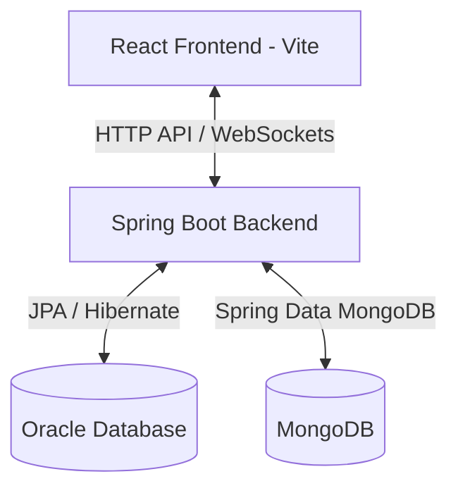
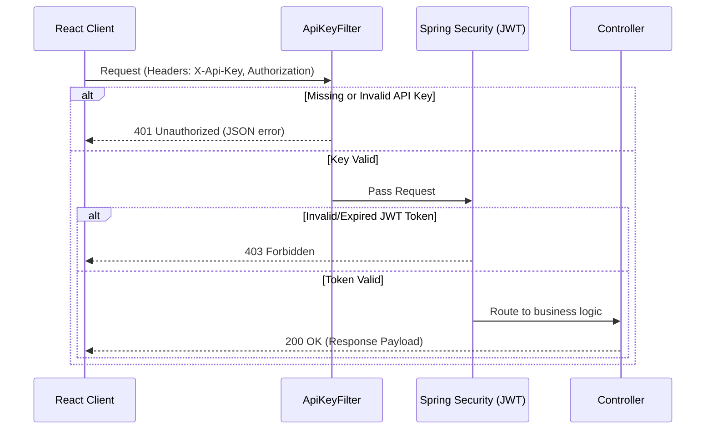

# Project Review Guideline — HandyServe Pro

This document provides a comprehensive, step-by-step guide for your project review presentation tomorrow. It covers the system architecture, tech stack details, live demo script, and database verification queries.

---

## 1. Technology Stack Architecture

The application is built using a modern, scalable, decoupled architecture with a hybrid database storage model.



### Frontend Client
* **Core Framework**: React 18 powered by **Vite** for optimized builds and fast module reloading.
* **State Management**: React Context API (`AuthContext`, `ThemeContext`) for sharing authentication, real-time booking lists, notifications, and theme preferences.
* **Routing**: React Router DOM (v6) with custom `Protected`, `Public`, and `Pending` guards for security lockouts.
* **Styling**: Vanilla CSS utilizing custom variables in `globals.css` to build light/dark modes, smooth transitions, and premium components.
* **File Upload Processing**: Utilizing `FileReader API` to convert file uploads (PDFs, JPEGs, PNGs) into Base64 data URLs for storage, and HTML5 Canvas context for profile image resizing.

### Backend Application
* **Framework**: Spring Boot (v3.3.x) with Java 17.
* **Security & Auth**: Spring Security with stateless **JWT tokens** (access token + refresh token mechanism) and custom BCrypt password hashing.
* **API Protection**: Custom `ApiKeyFilter` Order(1) intercepting headers (`X-Api-Key`) to validate requests against seeded key configurations in database.
* **Real-time Connection**: Spring WebSocket (`/ws/**` endpoint) providing live location streaming for provider tracking and instant messaging in chat.

### Hybrid Database Engine
1. **Oracle SQL Database**: Persists transactional, highly-structured relational records:
   * `HS_USERS`: Core user accounts (Customers, Providers, Administrators).
   * `HS_API_KEYS`: API authorization metadata definitions.
   * `HS_BOOKINGS`: Customer appointments, status, and pricing details.
   * `HS_LEAVE_REQUESTS`: Provider off-day calendar slots.
   * `HS_NOTIFICATIONS`: Triggered notification items.
2. **MongoDB**: Stashes semi-structured, document-based records:
   * `HS_CHAT_MESSAGES`: Messaging history between customers and providers.
   * `HS_DISPUTES`: Support tickets, customer issue logs, and notes.

---

## 2. API Key & Security Gateway Flow

Every service execution from the frontend calls `apiFetch`, which automatically binds the appropriate API key header before dispatching the request.



---

## 3. Step-by-Step Live Demo Presentation Script

Follow this sequence to show the reviewers a complete end-to-end workflow of your newly implemented provider document verification, lockdown, and admin controls.

### Step 1: Provider Registration & Form Validations
1. Open the landing page and click **Join as Professional** (Register).
2. Choose **Service Provider** role.
3. Fill personal details. Test the validation by entering:
   * A 10-digit Aadhaar number (Form should warn: *Aadhaar Number must be exactly 12 digits.*).
   * An incorrect IFSC Code format (Form should warn: *IFSC Code must be valid...*).
4. Enter correct details, upload a profile photo, and select a PDF or Image for:
   * Aadhaar Card, Driving License, and Bank Passbook.
5. Click **Create Account**.

### Step 2: Lockout Verification (Strict Security)
1. You will be redirected to the **Provider Dashboard**.
2. Point out the warning banner: `⏳ Verification Pending — Your uploaded documents are under review...`.
3. Try toggling the **Availability Status** at the top right (It is disabled and says "Disabled").
4. Point out the sidebar navigation menu: all items (Jobs, Disputes, Earnings, Off Day) are grayed out with a `not-allowed` cursor.
5. Try typing `/provider/jobs` manually in the browser address bar. Point out that the system automatically intercepts this and redirects you back to `/provider`.

### Step 3: Administrative Approval Panel
1. Log out, and log in as the Administrator:
   * **Email**: `admin@handyserve.com`
   * **Password**: `admin123`
2. Go to **Providers** in the sidebar.
3. Find your newly registered provider in the table (Show the `⏳ Pending` badge under the *Verification* column).
4. Click **Review Docs**.
5. Show the side-by-side verification modal:
   * Left: Personal, identity, and bank account fields.
   * Right: Previews of uploaded documents (rendered natively for images, embedded in iframes for PDFs).
6. Click **Approve & Verify Account**. The badge dynamically changes to `✓ Verified`.

### Step 4: Verification Deletion (Decline Request)
1. Register another dummy provider account.
2. Log back in as Admin, find the dummy provider, and click **Review Docs**.
3. Click **Reject & Decline**.
4. Show that the provider instantly vanishes from the administrator list because the database terminated/deleted the account.

### Step 5: Unlocked Provider Dashboard
1. Log back in as the first (now verified) provider.
2. The warning banner is gone.
3. The sidebar navigation links are active.
4. The **Availability Status** switch is now enabled. Toggle it to "Available".

---

## 4. Querying the Database for Reviewers

If the panel asks you to show where the records are stored in the database, open your SQL client or terminal and run these queries.

### Oracle DB queries
* To view user details, document Base64 LOBs, and verification status:
  ```sql
  SELECT id, name, email, role, verified, aadhaar_number, driving_license_number, bank_name, bank_account_number FROM HS_USERS WHERE role = 'provider';
  ```
* To view API Keys configured in the security system:
  ```sql
  SELECT api_identifier, feature_name, http_method, endpoint_pattern, allowed_roles FROM HS_API_KEYS WHERE api_identifier IN ('HSP-PROV-VERIFY', 'HSP-PROV-DELETE');
  ```
* To check user bookings:
  ```sql
  SELECT id, customer_name, provider_name, service, amount, status FROM HS_BOOKINGS ORDER BY created_at DESC;
  ```

### MongoDB Queries
* To view disputes filed by users:
  ```javascript
  db.HS_DISPUTES.find().pretty();
  ```
* To check WebSocket message threads/chat history between users:
  ```javascript
  db.HS_CHAT_MESSAGES.find().pretty();
  ```
